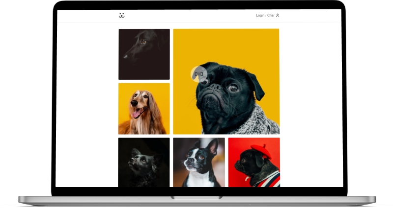

<h1 align="center" id="topo">Dogs - Rede Social para Cachorros. </h1>

<div align="center">

</div>

### 💻 Projeto

Dogs é o projeto final do curso de React JS Completo da Origamid.

Uma Rede Social para Cachorros.

[Clique aqui](https://github.com/brseghese/origamid-react-js)🔗 para acessar o repositório com a teoria do curso.

---

### 🔧 Ferramentas

O projeto foi desenvolvido com as seguintes ferramentas:

#### 🧪 Tecnologias

- [React.js](https://pt-br.reactjs.org/)

#### 📚 Dependências

- [React-Router-DOM](https://reactrouter.com/)
- API disponibilizada pela Origamid

---

### 🚀 ​ [Clique aqui](https://od-dogs.netlify.app/)🔗 e veja a aplicação no ar.


---

### ​👷‍♂️​ Acessar o Projeto

<a href="https://github.com/brseghese/origamid-dogs/tree/main">Acesse aqui</a>🔗 o código fonte pelo GitHub.

Faça o <a href="https://github.com/brseghese/origamid-dogs/archive/refs/heads/main.zip">Download aqui</a>🔗 do código fonte no formato zip.

Clone o repositório:

```
git clone https://github.com/brseghese/origamid-dogs.git
```

Entre na pasta do projeto:

```
cd origamid-dogs
```

Instale as dependências:

```
npm install
```

Execute a aplicação:

```
npm run start
```

Abra http://localhost:3000 no seu navegador para ver a aplicação

---

### 📝 License

Esse projeto é licenciado pela MIT License. Clique [aqui](https://pt.wikipedia.org/wiki/Licen%C3%A7a_MIT)🔗 para mais detalhes.

---

### ✒️ Autor

<a href="https://github.com/brseghese">  </a>

[Clique aqui](https://brseghese.github.io)🔗 e acesse meu portfólio! 💼 (em construção...)

---

#### 💬 Sinta-se a vontade para entrar em contato

[](https://www.linkedin.com/in/brunoseghese/) [](https://github.com/brseghese) [](mailto:brseghese@gmail.com)

---

> Desenvolvido com ❤️ por **Bruno Seghese**

---
